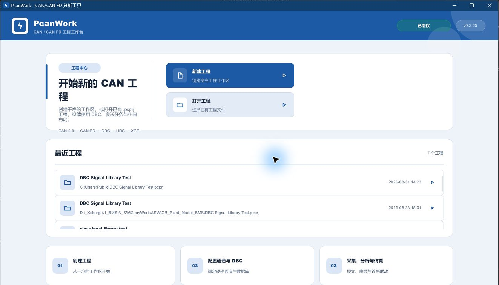
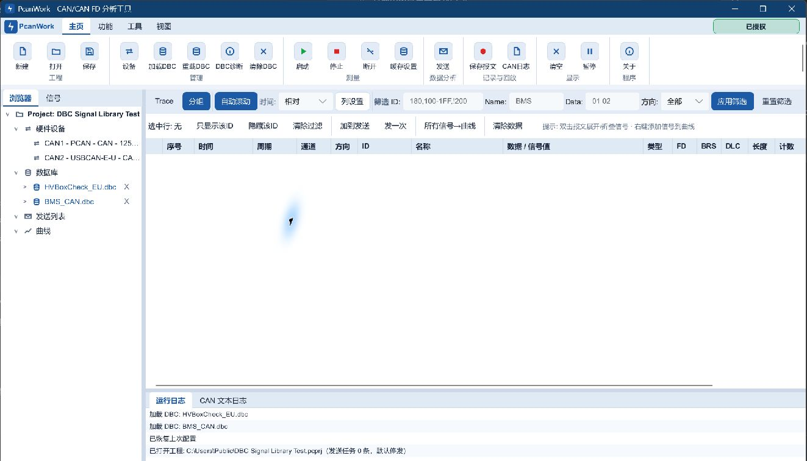
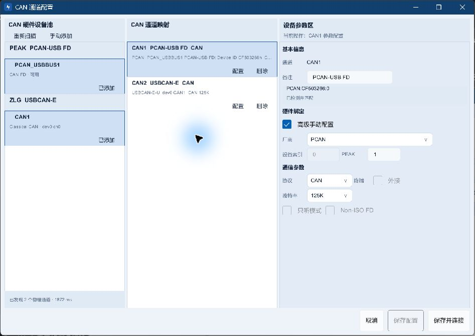
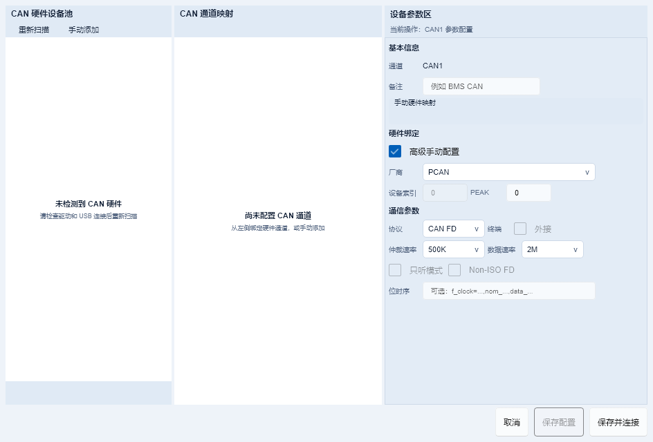

# PcanWork v0.3.26

**Windows CAN / CAN FD 工程分析平台**

面向汽车电子、储能、充电设备与工业通信研发测试，覆盖多厂商硬件接入、DBC 解析、报文采集与发送、记录回放、实时曲线、可视化仿真、printf-over-CAN、Modbus 与串口调试。

[GitHub 下载 v0.3.26](https://github.com/mycode2025-ui/pcanwork/releases/download/v0.3.26/PcanWork-Setup-0.3.26.exe) · [Gitee 下载 v0.3.26](https://gitee.com/mycode2025-ui/pcanwork/releases/download/v0.3.26/PcanWork-Setup-0.3.26.exe) · [官方网站](https://www.hexbyte.cn) · [版本说明](https://www.hexbyte.cn/release-notes-0.3.26.html)

## v0.3.26 更新

- 升级时依次关闭 PcanWork、Serial Tool、Modbus Tools；正常关闭失败才强制结束。
- 三个程序实测均能正常关闭，退出码为 0。
- 更新说明按 UTF-8 保留中文，移除 Markdown 标题与安装包元数据，改为三行清晰摘要。
- Slint 编译、更新单元测试及界面渲染均通过。

## 核心能力

- **多厂商 CAN / CAN FD**：PCAN（PEAK）、ZLG、ZHCX、GCAN 的设备扫描、通道配置和报文收发。
- **DBC 完整数值语义**：Unsigned、Signed、IEEE Float、IEEE Double，Intel / Motorola 字节序，factor、offset、单位和范围。
- **分析与记录**：16 列报文表、过滤、分组、变化高亮、实时曲线、CSV / ASC / BLF 记录与回放。
- **发送与仿真**：单次/周期发送、发送列表、可视化仿真工作区和 DBC 信号联动。
- **嵌入式调试**：printf-over-CAN 文本日志、UDS / XCP 工具入口。
- **Modbus Tools**：Modbus TCP / RTU 主站、从站仿真、寄存器视图、事件和流量监控。
- **Serial Tool**：普通串口调试、ANSI 交互终端、多行粘贴、文件和定时发送。

## 下载与校验

- 版本：`0.3.26`
- 安装包：`PcanWork-Setup-0.3.26.exe`
- 大小：`35,284,690` 字节
- SHA-256：`3ADE1753CC3BB0CB3A5282BEF591E4337BC8E2CC7204163E4F768A1924EAF3AA`
- 系统：Windows 10/11 64 位
- 签名状态：当前安装包未进行代码签名

真实 CAN/CAN FD 报文采集和发送需要兼容硬件及相应厂商驱动。工程、DBC、界面与配置等非总线功能可独立打开使用；当前版本不提供虚拟 CAN 总线。
