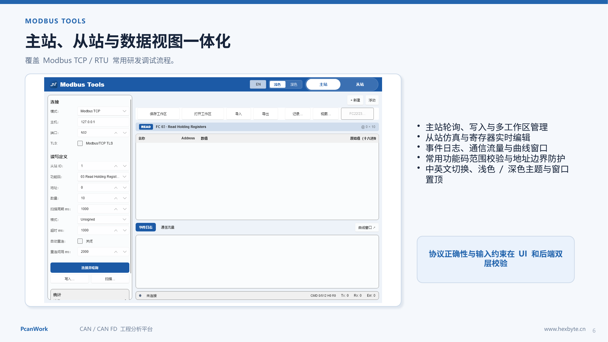

# 把 Modbus Poll 和 Slave 放进同一个窗口：PcanWork Modbus Tools 实战介绍

> 知乎原文：[https://zhuanlan.zhihu.com/p/2070567150901842037](https://zhuanlan.zhihu.com/p/2070567150901842037)

做 Modbus 设备联调时，工程师通常需要同时准备两类工具：一类负责像 Modbus Poll 一样主动轮询、读取和写入；另一类负责像 Modbus Slave 一样模拟从站、维护寄存器并响应主站请求。

当两套软件的连接参数、寄存器地址和数据格式分开管理时，最容易浪费时间的并不是协议本身，而是反复核对配置、切换窗口、重建测试现场。

**PcanWork Modbus Tools** 把主站轮询、从站仿真、寄存器数据视图、事件日志和通信分析放进同一套 Windows 桌面工具中，面向设备开发、台架联调和现场诊断提供一条完整工作流。

## 一、主站模式：覆盖 Modbus Poll 的核心调试流程

主站模式用于主动连接设备并周期读取数据。连接建立后，可以创建多个独立工作区，每个工作区保存自己的单元 ID、功能码、起始地址、数量、扫描周期、超时和数据格式。

- 支持常见 Modbus TCP 与 RTU 调试路径
- 支持线圈、离散输入、输入寄存器和保持寄存器
- 支持单次读取、周期扫描和写入操作
- 支持多个工作区同时管理不同地址段
- 支持 Unsigned、Signed、Hex、Float 等常用显示方式
- 支持自动重连、超时与重连间隔设置

在实际项目里，可以把 BMS 状态量、温度区间、告警位和控制寄存器分别放到不同工作区，而不必每次重新输入地址。工作区配置可以保存和重新打开，便于复现实验或交接测试任务。

## 二、从站模式：覆盖 Modbus Slave 的模拟需求

从站模式允许电脑直接模拟 Modbus TCP 或 RTU 设备。启动从站后，外部 PLC、网关、上位机或测试程序可以连接 PcanWork，并读取或写入模拟寄存器。

- 支持从站监听与单元 ID 处理
- 支持寄存器和线圈实时查看
- 允许直接编辑寄存器值并立即响应主站
- 显示原始十六进制值，方便定位字节序和数据类型问题
- 统计请求数量、运行状态和仿真状态

这对“设备固件还没完成，但上位机需要先联调”的场景很实用。测试人员可以先建立寄存器模型，模拟正常值、边界值和故障值，再验证主站软件的解析与告警逻辑。

## 三、为什么主站和从站应该放在同一套工具里

主站和从站本质上是同一个协议的两端。统一工具可以让参数、视觉语言和诊断信息保持一致：

- 同一套功能码与地址范围校验规则
- 同一套数据格式和寄存器显示方式
- 同一套浅色/深色主题、中英文切换与窗口置顶体验
- 事件日志和通信流量采用一致的时间线
- 工作区文件可以统一保存、打开、导入和导出

联调时可以先用从站模式建立被测设备，再用另一端主站进行轮询；出现异常后直接查看请求、响应与寄存器变化，不必在多个软件之间拼接证据。

## 四、通信流量、事件日志与曲线

仅看到“读取失败”往往不够。PcanWork 将运行事件和通信状态放在界面底部，可以观察连接、重连、超时、功能码请求和错误信息。

对连续变化的寄存器，还可以打开曲线窗口观察趋势。这比持续盯着表格数字更适合发现周期波动、突变、漂移和异常归零。

## 五、协议边界保护

Modbus 常见问题包括数量越界、起始地址与数量组合溢出、功能码不匹配、非法单元 ID，以及把远端设备 IP 错当成本机监听地址。

PcanWork 在界面输入层和后端执行层同时进行范围校验。TCP 从站监听时，如果填写的地址不属于本机网卡，会明确提示应使用 **0.0.0.0** 监听全部网卡，或填写本机实际 IPv4 地址，避免只给出难懂的系统错误码。

## 六、典型使用场景

- PLC、仪表、网关和传感器的 Modbus TCP / RTU 联调
- 充电桩、储能、BMS 与工业控制设备寄存器验证
- 在真实设备完成前模拟从站接口
- 复现现场寄存器异常和通信超时
- 保存多组轮询任务并长期观察数据变化

## 七、下载与项目地址

当前版本：**PcanWork v0.1.37**，运行平台：Windows x64。

- [GitHub 下载](https://github.com/mycode2025-ui/pcanwork/releases/download/v0.1.37/PcanWork-Setup-0.1.37.exe)
- [Gitee 下载](https://gitee.com/mycode2025-ui/pcanwork/releases/download/v0.1.37/PcanWork-Setup-0.1.37.exe)
- [产品网站](https://www.hexbyte.cn/)

PcanWork Modbus Tools 的目标不是简单复制传统工具，而是把主站、从站、数据视图和工程保存连接起来，让一次调试可以被保存、复现并继续扩展。

