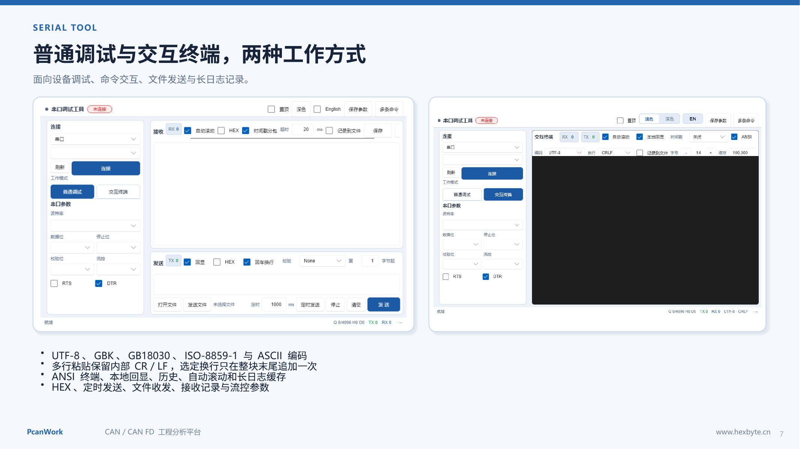

# 不只是收发 HEX：PcanWork Serial Tool 把串口助手和交互终端合在一起

> 知乎原文：[https://zhuanlan.zhihu.com/p/2070567518624823161](https://zhuanlan.zhihu.com/p/2070567518624823161)

传统串口助手很擅长完成一件事：选择串口参数，然后收一段、发一段数据。但设备进入 Linux、Bootloader、AT 命令或交互式 Shell 场景后，普通收发框很快会暴露局限：命令历史不好用、ANSI 颜色丢失、长日志复制卡顿，多行粘贴的换行规则也常常说不清楚。

**PcanWork Serial Tool** 将“普通串口调试”和“交互终端”作为两种明确的工作模式，既保留工程师熟悉的 HEX、定时发送与文件传输，也提供更接近 CMD/SSH 终端的输入、历史和日志体验。

## 一、普通调试模式：熟悉，但不简陋

普通调试模式适合协议报文、模块指令和重复测试。连接区集中管理串口、波特率、数据位、停止位、校验位、流控、RTS 与 DTR。

- 文本与 HEX 收发
- 定时发送与停止控制
- 回车换行和可选校验
- 发送文件与接收记录
- 本地回显、时间戳分包与自动滚动
- 保存参数和多条命令配置

多条命令功能可以把常用指令分别保存，并按顺序发送，适合设备初始化、生产测试和重复配置。收发计数、队列状态和当前串口参数始终可见，方便判断数据究竟有没有进入链路。

## 二、交互终端：更接近真正的命令行

切换到交互终端后，核心区域采用终端式深色工作区。输入行为、光标、历史和滚动更接近 CMD 或 Linux Shell，而不是传统的“发送文本框”。

- Enter 立即发送当前命令
- 支持上下方向键浏览历史
- 支持本地回显和 ANSI 终端效果
- 支持自动滚动及“跳至最新”
- 支持长时间日志缓存、全选与复制
- 断开串口后仍可安全切换工作模式

终端日志采用可控缓存，长时间运行时不会无限制吞噬内存。全选和复制仍然保留完整文本，但选区绘制会限制在可见视口内，避免蓝色选区越过终端边界。

## 三、多行粘贴到底怎么发送

很多串口工具对“多行粘贴”解释含糊：有的逐行触发发送，有的把换行改写，有的会意外追加多个 CRLF。

PcanWork 的规则非常明确：

- 键盘输入仍保持单行命令体验，Enter 立即发送
- 从剪贴板粘贴多行内容时，内部 CR / LF 原样保留
- 整段粘贴内容作为一个完整字节块，一次写入串口
- 当前选择的行尾只在整个内容末尾追加一次
- `#` 没有串口工具侧的注释语义，会作为普通字符发送

如果对端是主流 Linux Shell，换行符决定命令何时执行，而 `#` 是否代表注释由 Shell 自己解析；如果对端是自定义 MCU 协议，`#` 就只是普通字节。工具不替用户猜测对端协议，因此不会擅自删除注释或拆分命令。

## 四、编码与换行

串口乱码通常不是“串口坏了”，而是编码或行尾不一致。PcanWork 提供 UTF-8、GBK、GB18030、ISO-8859-1 与 ASCII 等常用编码，并支持 None、LF、CR、CRLF 等行尾策略。

状态栏持续显示当前编码、换行方式和串口参数，切换模式时无需重新猜测。对于 Linux 控制台通常优先选择 UTF-8；对于旧式模块或中文设备，可按设备文档选择 GBK/GB18030。

## 五、文件、日志与长时间运行

现场问题往往需要数小时甚至数天才能复现，因此“能收到数据”不等于“适合现场使用”。Serial Tool 提供接收记录到文件、缓存上限、自动滚动控制和保存失败提示。

当日志增长时，界面只绘制当前视口需要的内容；记录文件使用独立写入路径，磁盘异常会明确反馈，而不是悄悄丢数据。

## 六、统一的桌面体验

串口工具支持中英文切换、浅色/深色主题、窗口置顶和参数保存。顶部状态、按钮高度、复选框和焦点样式与 PcanWork Modbus Tools 保持一致，降低多个工具之间来回切换的学习成本。

## 七、适合哪些场景

- Linux 控制台、Bootloader 与设备 Shell 调试
- AT 指令模块、传感器和串口协议联调
- MCU 启动日志与长期运行记录
- HEX 数据、定时发送和文件传输
- 批量配置设备或执行多条初始化命令

## 八、下载与项目地址

当前版本：**PcanWork v0.1.37**，运行平台：Windows x64。

- [GitHub 下载](https://github.com/mycode2025-ui/pcanwork/releases/download/v0.1.37/PcanWork-Setup-0.1.37.exe)
- [Gitee 下载](https://gitee.com/mycode2025-ui/pcanwork/releases/download/v0.1.37/PcanWork-Setup-0.1.37.exe)
- [产品网站](https://www.hexbyte.cn/)

PcanWork Serial Tool 希望解决的不是“再做一个串口助手”，而是让普通协议调试和真正的终端交互都在同一个稳定、可记录的窗口里完成。

